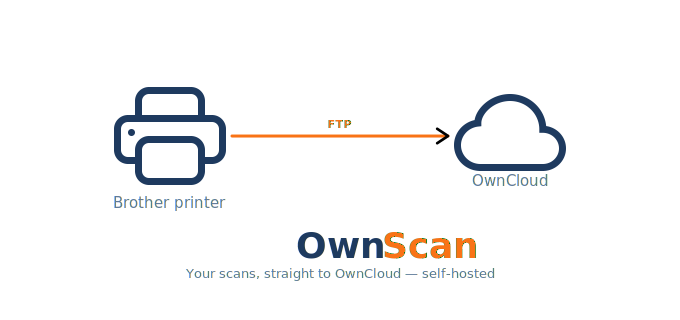

# OwnScan

**Your scans, straight to OwnCloud — self-hosted**

OwnScan bridges your Brother printer and OwnCloud. Scans are sent via FTP and automatically uploaded to OwnCloud.



---

> ⚠️ **Local network only**
> OwnScan is designed for use on a **local network only**.
> Do **NOT** expose this to the internet. There is no HTTPS, no firewall, and no rate limiting.

---

## How it works

```
Brother printer → FTP → OwnScan server → OwnCloud
```

When you scan a document on your Brother printer, it sends the file via FTP to the OwnScan server. OwnScan instantly detects the new file and uploads it directly to your OwnCloud account via WebDAV. Once the upload is complete, OwnScan deletes the file from the server — so the scan is stored permanently on OwnCloud, not on the OwnScan server. This means the OwnScan server requires almost no storage space, and your scans are always accessible through OwnCloud.

In short: scan on your printer → file lands in OwnCloud → OwnScan server stays empty.

## Requirements

- Ubuntu 24.04 LTS or higher
- OwnCloud instance on the same local network
- Brother printer with **Scan to FTP** support (see supported printers below)

## Supported printers

### Tested

| Model | Status |
|-------|--------|
| Brother MFC-J5320DW | ✅ Tested |
| Brother MFC-J6520DW | ✅ Tested |

### Not tested — should work

These models are confirmed to support Scan to FTP based on official Brother documentation.

| MFC inkjet | Laser mono MFC | Laser colour MFC |
|------------|----------------|------------------|
| MFC-J4510DW | MFC-L2710DW | MFC-L3720CDW |
| MFC-J4610DW | MFC-L2713DW | MFC-L3750CDW |
| MFC-J4710DW | MFC-L2730DW | MFC-L3760CDW |
| MFC-J5330DW | MFC-L2750DW | MFC-L3770CDW |
| MFC-J5340DW | MFC-L2770DW | MFC-L3780CDW |
| MFC-J5720DW | MFC-L2800DW | MFC-9130CW |
| MFC-J5730DW | MFC-L2820DW | MFC-9330CDW |
| MFC-J5740DW | MFC-L2880DW | MFC-9340CDW |
| MFC-J5910DW | MFC-L2900DW | |
| MFC-J5920DW | MFC-L2920DW | |
| MFC-J5930DW | | |
| MFC-J5945DW | | |
| MFC-J5955DW | | |
| MFC-J6510DW | | |
| MFC-J6530DW | | |
| MFC-J6540DW | | |
| MFC-J6555DW | | |
| MFC-J6910DW | | |
| MFC-J6920DW | | |
| MFC-J6930DW | | |
| MFC-J6935DW | | |
| MFC-J6940DW | | |
| MFC-J6945DW | | |
| MFC-J6955DW | | |

| Laser mono DCP | Laser colour DCP | Laser HL |
|----------------|------------------|----------|
| DCP-L2530DW | DCP-L3551CDW | HL-L2395DW |
| DCP-L2537DW | DCP-L3560CDW | HL-L2464DW |
| DCP-L2550DW | DCP-9020CDN | HL-L2465DW |
| DCP-L2640DW | | HL-L2480DW |
| DCP-L2680DW | | HL-L3290CDW |
| | | HL-L3300CDW |
| | | HL-3180CDW |

> This list is based on official Brother documentation. If your model has Scan to FTP, it will work with OwnScan.

## Installation

```bash
apt install curl -y && curl -sSL https://raw.githubusercontent.com/Linux-Ginger/ownscan/main/install.sh | bash
```

## Managing users

To add, edit or remove users after installation:

```bash
bash manage.sh
```

This opens an interactive menu where you can:
- View all users
- Add a new user
- Edit an existing user (FTP password, OwnCloud password, OwnCloud folder)
- Delete a user

## Uninstall

```bash
ownscan --uninstall
```

This opens an interactive uninstaller that removes all users, services, scripts and packages. Your OwnCloud files will not be deleted.

## Brother printer setup

After running the installer, configure your Brother printer via its web interface:

1. Go to `http://<printer-ip>` in your browser
2. Navigate to **Scan → Scan to FTP/Network profile**
3. Fill in:
   - **Host**: IP of your OwnScan server
   - **Username**: the FTP username you created
   - **Password**: the FTP password you created
   - **Directory**: `/`
   - **Port**: `21`
   - **Passive mode**: ON

## License

GNU General Public License v3.0 — see [LICENSE](LICENSE) for details.

---

Made with ❤️ by [Linux Ginger](https://github.com/Linux-Ginger)
